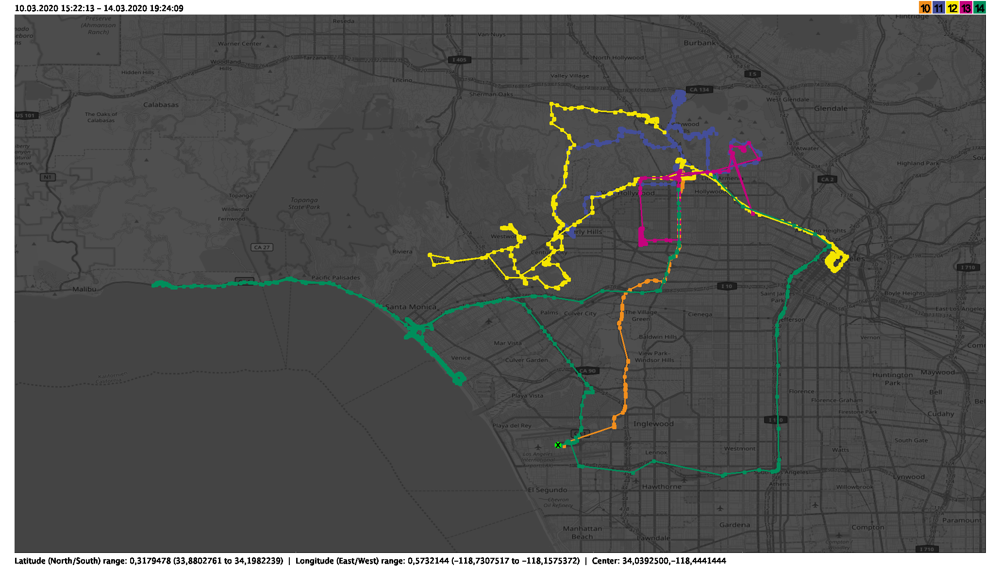
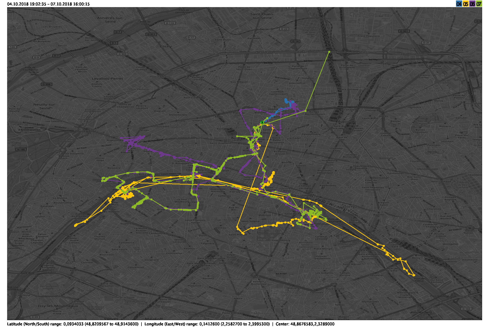
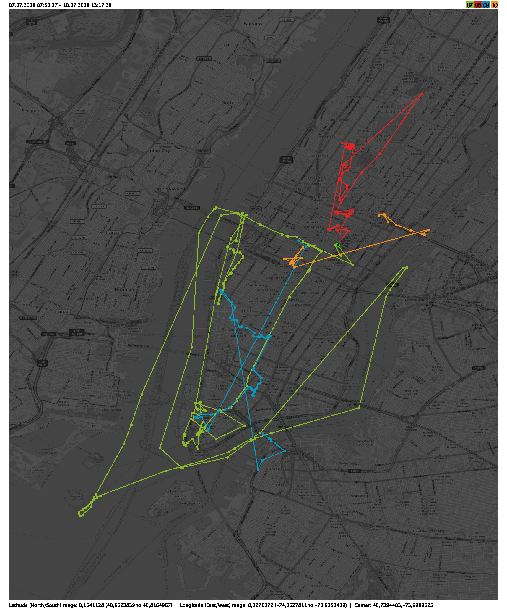
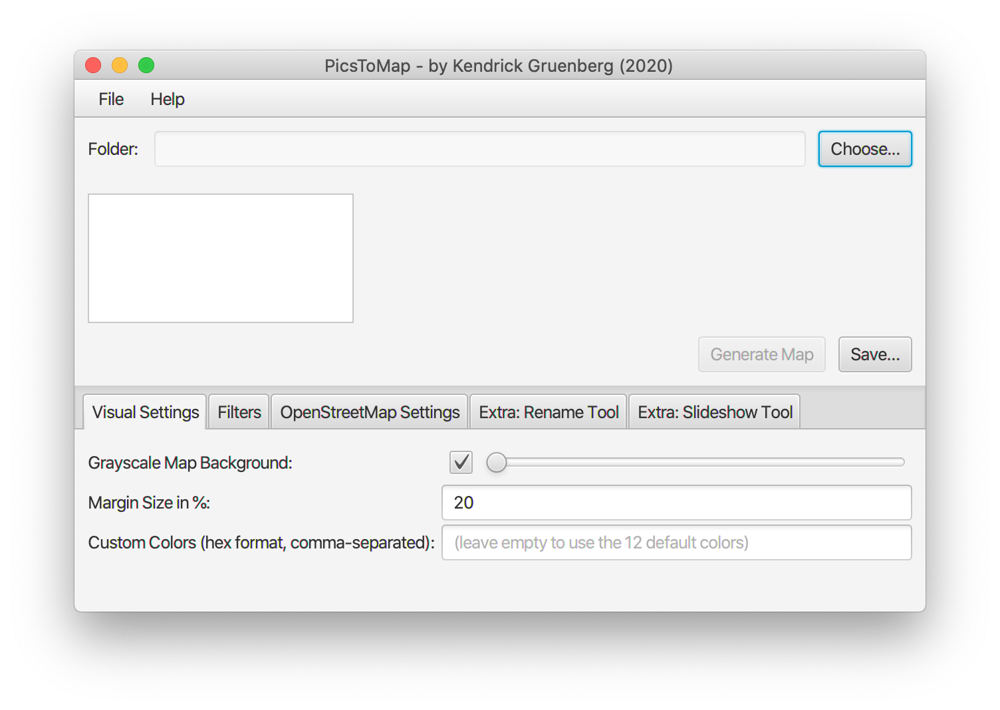

# PicsToMap
PicsToMap is a JavaFX application that creates an appealing map from the EXIF timestamps and geodata of your holiday photos.  
You simply select the folder with your holiday photos, let it parse the EXIF data, click 'Generate Map' and then 'Save'.  
It also gives you many options on how you'd like the map to look like and lets you choose any OpenStreetMap Tile Server for generating the background.

## Download
ToDo

## Features
* Graphical User Interface
* Works with JPEG and HEIF pictures (HEIF is the more efficient image format that the newer iPhones use by default instead of JPEG)
* Uses a different color (from the default set of 12 colors or your own set of colors) for every day of your holiday
* Appearance settings
    * Make the map background grayscale or not
    * Choose the size of the margin around the coordinate points in percent
    * Choose custom colors for the map points
* Many filtering options
    * Automatically ignore images with 'outlier' coordinates more than n standard deviations away from the map center
    * Ignore images taken before/after a certain date and time
    * Ignore image files that match a certain regular expression
* Choose a custom OpenStreetMap Tile Server for the map background or select one of the many given ones (User Agent specifiable as well)
* Comes with an additional 'Rename Tool' that automatically renames all of your holiday images using their EXIF data in a format that you specify. 

## Examples
5 days in Los Angeles:  

4 days in Paris:  

4 days in Manhattan:  

## User Interface
The UI looks like this:  

